# 🛒 Shop GCP — Terraform Infrastructure

Complete Infrastructure as Code for a production-grade E-Commerce platform on Google Cloud Platform.

## 🏗️ Architecture

```
                           🌐 Internet
                                │
                    ┌───────────▼───────────┐
                    │   HTTP Load Balancer  │
                    │   (Global Static IP)  │
                    └───────────┬───────────┘
                                │
              ┌─────────────────┼─────────────────┐
              │                 │                 │
           zone-a            zone-b            zone-c
          ┌──────┐          ┌──────┐          ┌──────┐
          │ VM   │          │ VM   │          │ VM   │
          └───┬──┘          └───┬──┘          └───┬──┘
              │                 │                 │
              └─────────────────┼─────────────────┘
                     Web VPC (10.0.0.0/16)
                                │
                         VPC Peering ⇅
                                │
                     DB VPC (10.1.0.0/16)
              ┌─────────────────┼─────────────────┐
              │                                   │
        ┌─────▼──────┐                    ┌──────▼──────┐
        │ MariaDB VM │                    │ GCS Bucket  │
        │(No Ext IP) │                    │  (Private)  │
        └────────────┘                    └─────────────┘
              │
         Cloud NAT
              │
         🌐 Internet
```

## 📦 What Gets Created

### Networking
- 2 VPC Networks (Web + DB)
- 2 Subnets with non-overlapping CIDRs
- VPC Peering (bidirectional)
- Cloud NAT for DB VPC outbound traffic
- 7 Firewall Rules (SSH via IAP, HTTP, MySQL internal, etc.)

### Compute
- Database VM with MariaDB (auto-installed via startup script)
- Instance Template for Web VMs
- Regional Managed Instance Group (Multi-Zone)
- Autoscaler (2-6 VMs based on CPU)
- Health Check

### Storage & Identity
- Private Cloud Storage Bucket (for products + user uploads)
- Service Account with least-privilege IAM

### Load Balancing
- Global HTTP Load Balancer
- Backend Service with health checks
- URL Map + HTTP Proxy
- Global Static IP

## 📁 Project Structure

```
shop-terraform/
├── README.md
├── main.tf                    # Root module
├── providers.tf               # Terraform providers
├── variables.tf               # Input variables
├── outputs.tf                 # Output values
├── terraform.tfvars.example   # Example values
├── modules/
│   ├── network/               # VPCs, Subnets, Firewall, Peering, NAT
│   ├── iam/                   # Service Account + roles
│   ├── storage/               # GCS Bucket
│   ├── database/              # DB VM + MariaDB
│   └── compute/               # Template + MIG + LB
├── scripts/
│   ├── db-startup.sh          # MariaDB installation
│   └── web-startup.sh         # Web VM setup
└── app/
    ├── backend.py             # FastAPI backend
    ├── index.html             # React frontend
    ├── nginx.conf             # Reverse proxy config
    └── requirements.txt       # Python dependencies
```

## 🚀 Quick Start

### Prerequisites
- Terraform >= 1.5
- Google Cloud SDK (`gcloud`)
- GCP Project with billing enabled

### 1. Clone & Configure

```bash
git clone https://github.com/YOUR_USERNAME/shop-gcp.git
cd shop-gcp/terraform

# Copy and edit variables
cp terraform.tfvars.example terraform.tfvars
nano terraform.tfvars
```

### 2. Authenticate

```bash
gcloud auth application-default login
```

### 3. Deploy

```bash
terraform init
terraform plan
terraform apply
```

Takes ~10-15 minutes for everything to be ready.

### 4. Get the URL

```bash
terraform output website_url
```

Open in browser — done! 🎉

### 5. Cleanup

```bash
terraform destroy
```

## 🔒 Security Features

| Feature | Implementation |
|---------|---------------|
| No public DB | `--no-address` on DB VM |
| SSH via IAP only | Firewall: `35.235.240.0/20` |
| VPC Isolation | Separate Web + DB VPCs |
| Least Privilege IAM | Dedicated SA with minimal roles |
| Private Bucket | Signed URLs only (no public access) |
| Firewall Tags | `web-server`, `mysql-server` for precise targeting |

## 🎓 GCP Services

| Service | Purpose |
|---------|---------|
| Compute Engine | Web + DB VMs |
| Instance Templates | Reusable VM blueprint |
| Managed Instance Group | Multi-zone auto-scaling |
| HTTP(S) Load Balancer | Global traffic distribution |
| VPC + Peering | Network segmentation |
| Cloud NAT | Outbound without external IPs |
| Cloud Storage | Product images + user uploads |
| IAP | Secure SSH access |
| IAM | Service accounts |


## 📸 Screenshots

### 🌐 Networking — Multi-VPC with Peering

The project uses two isolated VPCs connected via bidirectional Peering:

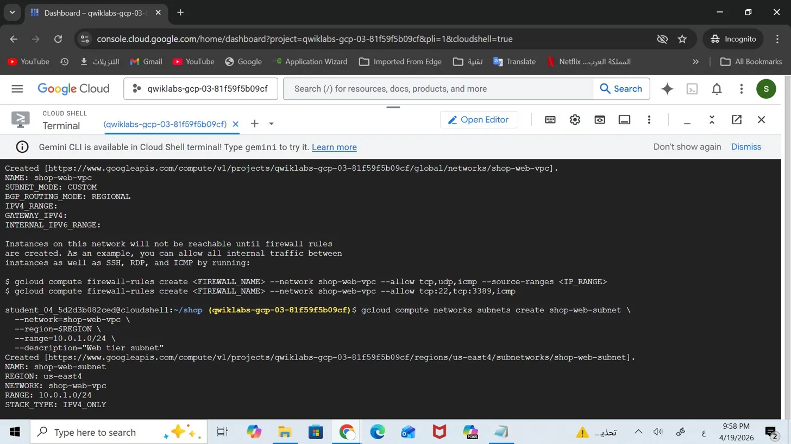
*Web tier VPC (10.0.0.0/16)*

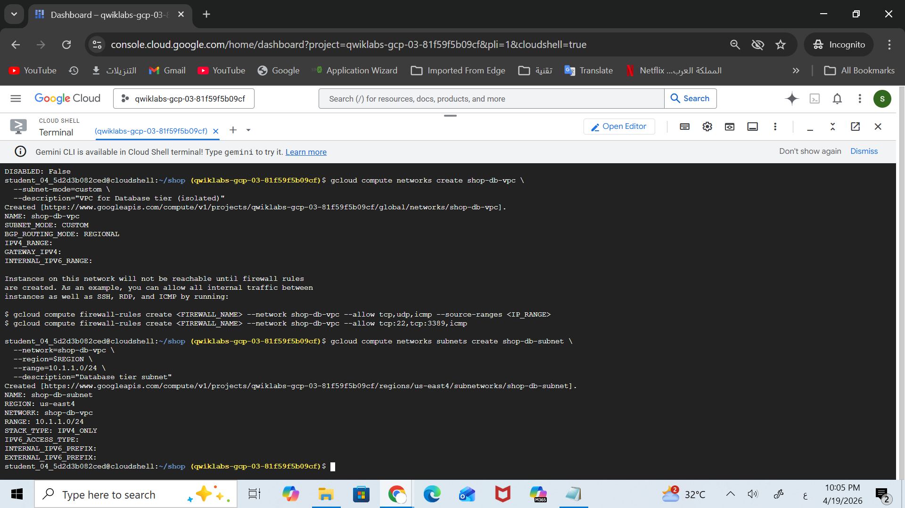
*Isolated Database VPC (10.1.0.0/16)*

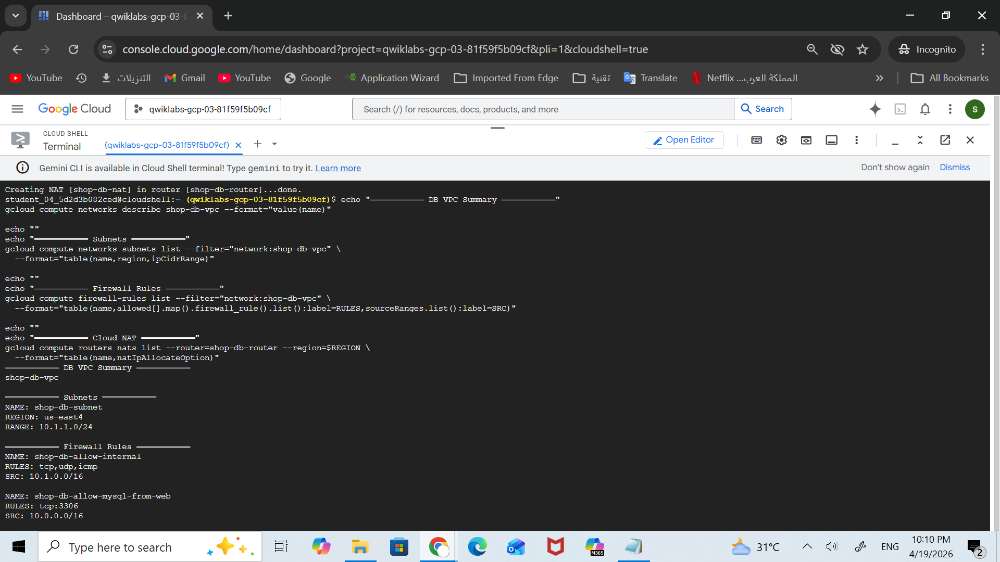
*Complete DB network: Subnet + Firewalls + Cloud NAT*

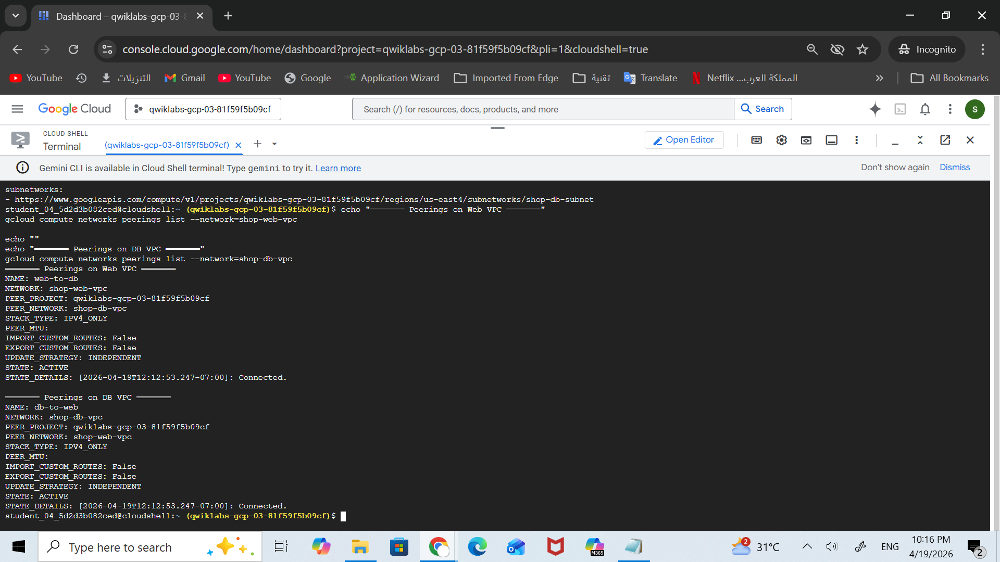
*Bidirectional peering — both directions ACTIVE*

---

### 📦 Cloud Storage

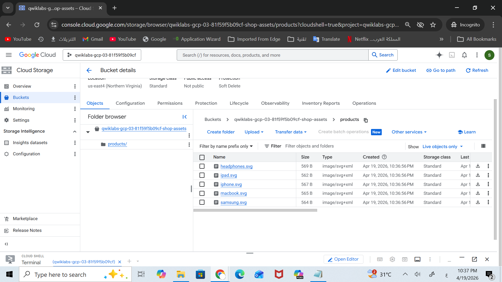
*Private bucket with product SVG images*

---

### 💻 Compute Infrastructure

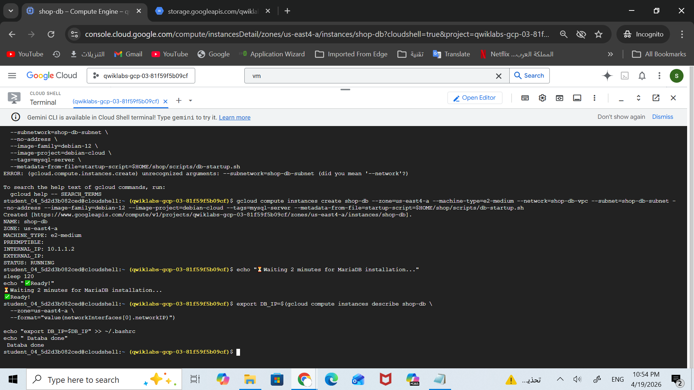
*Database VM with no external IP (internal only: 10.1.1.2)*

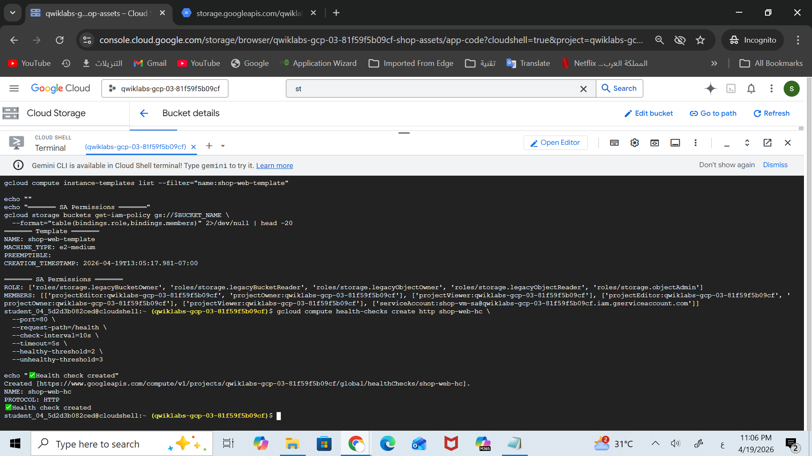
*Web VM template with Service Account + Health Check*

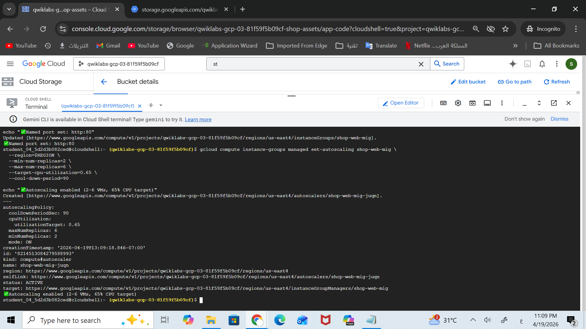
*Autoscaling configured (2-6 VMs, 65% CPU target)*

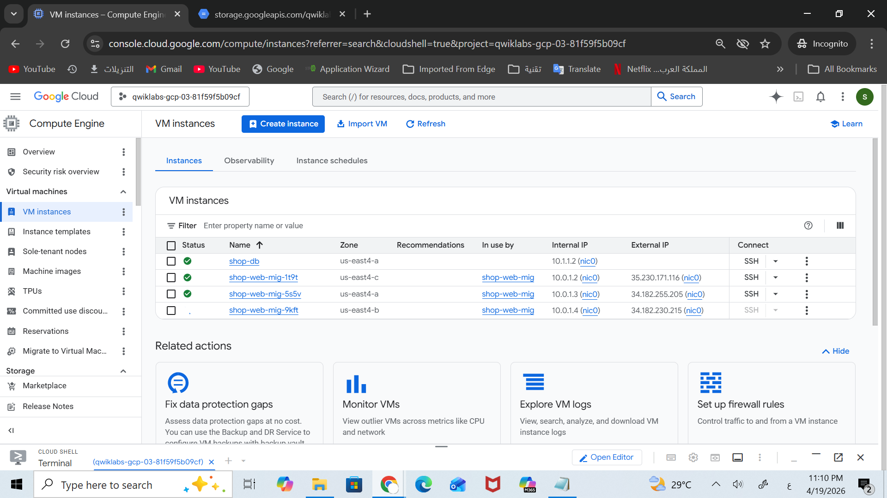
*3 Web VMs distributed across zones (us-east4 a/b/c)*

---

### ⚖️ Load Balancer

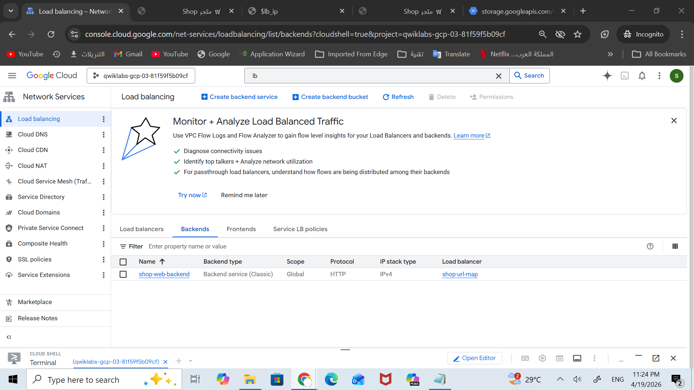
*Global HTTP Load Balancer — 2 of 2 backends Healthy*

---

### 🛒 Live Application

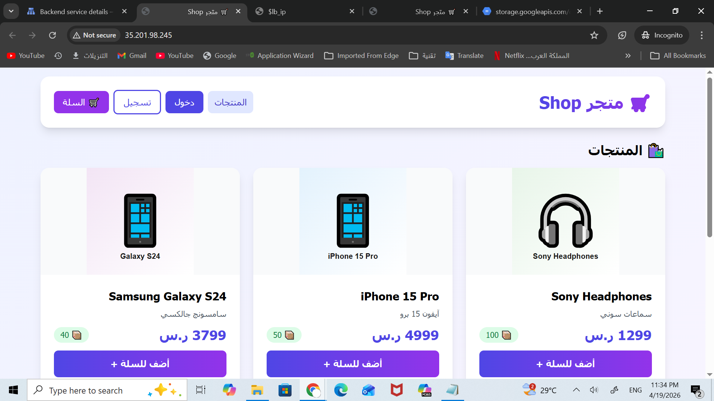
*Deployed e-commerce site accessible via Load Balancer IP*

---

### 💾 Database

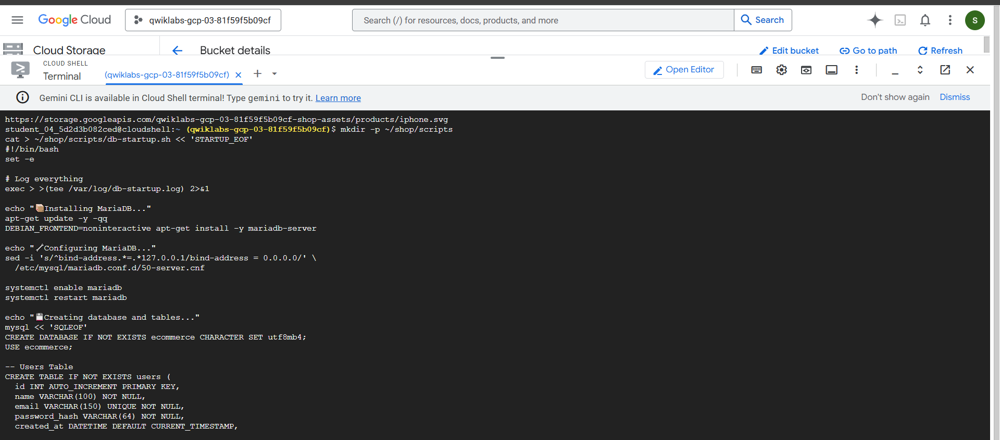
*Users, orders, and products data in MariaDB*

See [docs/](docs/) folder.


## 🎓 Learning Objectives

- ✅ Multi-VPC design with Peering
- ✅ Managed Instance Groups and auto-scaling
- ✅ Global HTTP Load Balancing
- ✅ Signed URLs for secure object access
- ✅ Service Accounts with least privilege
- ✅ Infrastructure as Code (Terraform)

---

Built as part of **Architecting with Google Compute Engine** course.
